# Prism

[中文文档](docs/README_CN.md)

An automation tool for deploying multiple iMessage relay services on a single Mac.

**What it does**: Prism creates multiple macOS user accounts, installs an independent iMessage Server + frpc tunnel for each user, and ensures all services automatically restart after reboot.

---

## Table of Contents

- [Deployment Overview](#deployment-overview)
- [Phase 1: Preparation (Manual)](#phase-1-preparation-manual)
- [Phase 2: Host Deployment (Host Mode)](#phase-2-host-deployment-host-mode)
- [Phase 3: Sub-User Deployment (User Mode)](#phase-3-sub-user-deployment-user-mode)
- [Phase 4: Maintenance](#phase-4-maintenance)
- [Configuration Reference](#configuration-reference)
- [File Structure](#file-structure)
- [Troubleshooting](#troubleshooting)

---

## Deployment Overview

```mermaid
flowchart TD
    subgraph phase1["🔧 Phase 1: Preparation (Manual, One-time)"]
        A1["Disable SIP in Recovery Mode"]
        A2["Enable Remote Login (SSH)"]
    end

    subgraph phase2["💻 Phase 2: Host Deployment (sudo ./prism)"]
        B1["Preflight Checks & Auto-fix"]
        B2["Install Dependencies"]
        B3["Create Sub-users & Download Bundle"]
        B4["Install LaunchDaemons"]
        B5["Configure Fast Login"]
        B1 --> B2 --> B3 --> B4 --> B5
    end

    subgraph phase3["👤 Phase 3: Sub-user Deployment (./prism user)"]
        C1["Prewarm Permissions"]
        C2["Send Test Message"]
        C3["Get API Key"]
        C4["Deploy Services"]
        C1 --> C2 --> C3 --> C4
    end

    subgraph phase4["🚀 Daily Operation (Fully Automated)"]
        D1["Auto-start All Services on Boot"]
        D2["Fast Login Activates GUI Sessions"]
        D3["Keepalive Maintains Connection"]
        D4["Hourly Auto-update Checks"]
    end

    phase1 --> phase2
    B1 -.->|"If reboot needed"| reboot["⟳ Auto-reboot & Continue"]
    reboot -.-> B1
    phase2 --> phase3
    phase3 --> phase4
```



---

## Phase 1: Preparation (Manual)

This phase must be **completed manually** and is a prerequisite for running Prism.

### 1.1 Disable SIP (System Integrity Protection)

SIP must be disabled, otherwise Prism cannot inject into the iMessage process.

**Steps:**

1. Shut down your Mac
2. Press and hold the power button until you see "Loading startup options"
3. Select "Options" to enter Recovery Mode
4. Open "Utilities" → "Terminal" from the menu bar
5. Run the command:
   ```bash
   csrutil disable
   ```
6. Restart your Mac

**Verify:**
```bash
csrutil status


# Should display: System Integrity Protection status: disabled.
```

> 💡 **Why disable SIP?**
> The iMessage service needs to inject into the `imagent` process to intercept and send messages. SIP blocks this injection.

### 1.2 Enable Remote Management and Remote Login

**Steps:**

1. Open "System Settings" → "General" → "Sharing"


2. Enable "Remote Management", click the ⓘ button, select "All users"


3. Enable "Remote Login", click the ⓘ button, select "All users"


> 💡 **Why are these two required?**
> - **Remote Login (SSH)**: Fast Login uses SSH to establish local VNC tunnels
> - **Remote Management (VNC)**: Allows VNC connections to activate sub-user GUI sessions
>
> iMessage requires an active GUI session to receive messages properly. Fast Login handles this automatically.

---

## Phase 2: Host Deployment (Host Mode)

Run Prism as **administrator** to initialize the host and create sub-users.

### 2.1 Create Configuration File

```bash
cp config/prism.json.example config/prism.json
```

Edit `config/prism.json`:

```json
{
  "globals": {
    "machine_id": "mymac",
    "default_password": "Photon2025",
    "frpc": {
      "server_addr": "your-frps-server.com",
      "server_port": 7000
    },
    "domain_suffix": "imsg.example.com",
    "service": {
      "archive_url": "gh://your-org/your-repo/bundle-macos-arm64.tar.gz",
      "start_port": 10001
    },
    "nexus": {
      "base_url": "https://your-backend.com"
    }
  }
}
```

### 2.2 Set Environment Variables

Create a `.env` file (or export directly):

```bash
FRPC_TOKEN=your_frpc_auth_token
GITHUB_TOKEN=your_github_token  # For downloading from private repos
```

### 2.3 Get the Prism Binary

**Option 1: Download Pre-built Release (Recommended)**

Download the latest `prism-darwin-arm64.tar.gz` from [GitHub Releases](https://github.com/photon-hq/Prism/releases) and extract it.

**Option 2: Build Locally**

```bash
go build -o prism ./cmd/prism
```

### 2.4 Run Host Initialization

```bash
sudo ./prism
```

Select **"Setup"** from the TUI menu.


**Prism will automatically perform the following:**

#### Step 1: Preflight Checks & Auto-fix

| Check Item | Action |
|------------|--------|
| SIP Status | Verify only, manual disable required |
| boot-args | **Auto-configure** AMFI parameters |
| DisableLibraryValidation | **Auto-set** to true |

> 💡 **About AMFI Parameters:**
> Prism automatically runs `nvram boot-args="amfi_get_out_of_my_way=1 amfi_allow_any_signature=1 -arm64e_preview_abi ipc_control_port_options=0"`. No manual action needed.

> ⚠️ **About Auto-reboot:**
> If boot-args or DisableLibraryValidation are modified, the system will display a 10-second countdown then **automatically reboot**. Press `Ctrl+C` to cancel and reboot manually. After reboot, run `sudo ./prism` again to continue.

#### Step 2: Install Dependencies

Prism automatically detects and installs missing dependencies:

- **Homebrew** → Runs the official install script
- **Node.js 18** → `brew install node@18`
- **frpc** → `brew install frpc`

> 💡 **Privilege De-escalation:**
> Since Homebrew refuses to run as root, Prism automatically uses `SUDO_USER` to run brew commands with reduced privileges.

#### Step 3: Create Sub-users

After entering the desired number of users (e.g., 3), Prism will:

1. Create macOS users: `mymac-1`, `mymac-2`, `mymac-3`
2. Generate random passwords (or use configured default password)
3. Save passwords to `output/secrets/users.csv`

#### Step 4: Download Service Bundle

Download and extract the iMessage service bundle to each user's `~/services/imsg/`:

- Write `config.json` (containing port, domain, etc.)
- Write `frpc.toml` (containing tunnel configuration)
- Copy `prism` binary to user directory

> 💡 **Private Repository Support:**
> Configure the `GITHUB_TOKEN` environment variable to download from private GitHub repositories. URL format: `gh://org/repo/file.tar.gz`

#### Step 5: Install LaunchDaemons

Create system-level daemons in `/Library/LaunchDaemons/`:

| LaunchDaemon | Function |
|--------------|----------|
| `com.prism.host-autoboot` | Host daemon |
| `com.imsg.server.<username>` | iMessage Server |
| `com.imsg.frpc.<username>` | frpc tunnel |

> 💡 **No Login Required:**
> LaunchDaemons use the `UserName` key to run as specified users, combined with `RunAtLoad` and `KeepAlive` to ensure automatic startup after boot—no user login required.

#### Step 6: Configure Fast Login

Prism installs the Fast Login service in the admin user's directory:

- Script: `~/prism-fast-login.sh`
- LaunchAgent: `~/Library/LaunchAgents/com.prism.fast-login.plist`

> 💡 **How Fast Login Works:**
> After the admin logs in, the script automatically establishes local VNC tunnels via SSH (ports 5901-590x), connects to each sub-user to complete VNC authentication, and activates their GUI sessions. After activation, VNC windows close automatically while sub-user sessions remain active. This ensures iMessage can receive messages properly.

**After Completion:**
- User passwords saved in `output/secrets/users.csv`
- State information saved in `output/state.json`

---

## Phase 3: Sub-User Deployment (User Mode)

For each created sub-user, you need to **log into that user account** to complete initial configuration.

### 3.1 Switch to Sub-user

1. Log out of the current admin account
2. Log in as the sub-user (e.g., `mymac-1`)
3. Password is in `output/secrets/users.csv`

### 3.2 Run User Deployment

```bash
cd ~/services/imsg
./prism user
```


Execute the following operations in order:

#### Step 1: Prewarm Permissions

After selecting this menu item, macOS permission dialogs will appear. Click **"Allow"** for each:

- Messages automation access
- System Events automation access
- Full Disk Access (if prompted)

> 💡 **Why are these permissions needed?**
> - Messages access: Read `chat.db` to get phone number/email
> - System Events: Send keystrokes for automation
> - Full Disk Access: Access `~/Library/Messages/` directory

#### Step 2: Send a Test Message

Open the Messages app and **send an iMessage** to any contact.

> ⚠️ **This step is critical!**
> Prism detects your phone number or email by querying the `account` field from **sent messages** in `chat.db`. If no messages have been sent, there's no record in the database, and auto-detection will fail.

#### Step 3: Get API Key

Request a one-time API Key from the Nexus backend. **Make sure to copy and save it!**

> 💡 **What is the API Key for?**
> This key is used for iMessage Server to communicate with the backend—it's essential for the service to function properly.

#### Step 4: Deploy / Start Services

This step will:
1. Validate configuration files (`config.json`, `frpc.toml`)
2. Auto-detect phone number/email (from `chat.db`)
3. Start iMessage Server and frpc (via `launchctl kickstart`)
4. Wait for health check to pass (`http://localhost:<port>/health`)
5. Install Keepalive heartbeat service

> 💡 **Phone Number Detection Logic:**
> Prism queries the `account` field from sent messages in `chat.db`, prioritizing phone numbers (`P:+1234567890`) over emails (`E:user@icloud.com`).

> 💡 **Keepalive Service:**
> After successful deployment, a heartbeat service is automatically installed (`~/Library/LaunchAgents/com.imessage.keepalive.plist`). It reads `chat.db` every 10 minutes and triggers the `imagent` XPC to prevent iMessage from disconnecting due to inactivity. Logs are at `~/Library/Logs/imessage-keepalive.log`.

> 💡 **If Auto-detection Still Fails:**
> Use "Rename friendly name" in the menu to manually set your phone number or email.

#### Other User Mode Operations

| Menu Item | Function |
|-----------|----------|
| **Stop all services** | Stop iMessage Server and frpc |
| **Start all services** | Start services (after stopping) |
| **Restart server** | Restart only iMessage Server |
| **Restart frpc** | Restart only frpc tunnel |
| **Rename friendly name** | Manually set phone/email and restart frpc |

> 💡 **Services Don't Stop When TUI Exits:**
> Selecting "Quit" to exit Prism doesn't affect running services. Services are managed by LaunchDaemons and will keep running.

### 3.3 Repeat for Other Sub-users

Repeat steps 3.1-3.2 for `mymac-2`, `mymac-3`, and other sub-users.

> 💡 **No Manual Login Required After Reboot:**
> After initial configuration, machine restarts will automatically:
> 1. LaunchDaemons start all users' iMessage Server and frpc
> 2. After admin logs in, Fast Login activates sub-user GUI sessions
> 3. Keepalive maintains iMessage connections

---

## Phase 4: Maintenance

These operations can be performed in Host mode during daily operation.

### 4.1 Enter Host Management Interface

```bash
sudo ./prism
```

### 4.2 Available Operations

| Menu Item | Function |
|-----------|----------|
| **Add users** | Add more sub-users |
| **View users** | View current user list and password location |
| **Update user code** | Update all users' iMessage service code |
| **Check service status** | Check service status for all users |
| **Remove user** | Select and remove a specific user |

> 💡 **What Does "Update user code" Do?**
> 1. Download the latest service bundle from remote
> 2. Sync to all users' `~/services/imsg/` directories
> 3. Restart running services
> 4. Update Keepalive script to latest version

### 4.3 Auto-update Mechanism

The Host daemon (`com.prism.host-autoboot`) **automatically checks for updates every hour**.

**How it works:**
1. Call GitHub API to get the latest release for the repo in `archive_url`
2. Compare local version file (`output/cache/current_version.txt`) with latest tag
3. If new version found: download → extract → sync to all user directories → restart running services
4. Record new version number, skip on next check

> 💡 **Auto-update Requirements:**
> - `archive_url` must use `gh://` format
> - Cannot use fixed version `@tag` syntax
> - Requires `GITHUB_TOKEN` for private repositories

> 💡 **View Update Logs:**
> Daemon logs are output to system logs. View with:
> ```bash
> log show --predicate 'subsystem == "com.apple.launchd"' --info --last 1h | grep prism
> ```

### 4.4 View Logs

```bash
# iMessage Server logs
tail -100 ~/Library/Logs/imsg-server.log

# frpc tunnel logs
tail -100 ~/Library/Logs/frpc.log

# Keepalive heartbeat logs
tail -100 ~/Library/Logs/imessage-keepalive.log

# Fast Login logs (under admin account)
tail -100 ~/Library/Logs/prism-fast-login.log
```

---

## Configuration Reference

### prism.json Fields

| Field | Description | Example |
|-------|-------------|---------|
| `machine_id` | Username prefix | `"mymac"` → creates `mymac-1`, `mymac-2` |
| `default_password` | Password for new users (empty = random) | `"Photon2025"` |
| `frpc.server_addr` | frps server address | `"frps.example.com"` |
| `frpc.server_port` | frps server port | `7000` |
| `domain_suffix` | Subdomain suffix | `"imsg.example.com"` |
| `service.archive_url` | Service bundle download URL | `"gh://org/repo/file.tar.gz"` |
| `service.start_port` | First user's port, increments for subsequent users | `10001` |
| `nexus.base_url` | Backend API URL | `"https://api.example.com"` |

> 💡 **archive_url Formats:**
> - Basic format: `gh://owner/repo/filename.tar.gz` (auto-fetch latest release)
> - Fixed version: `gh://owner/repo/filename.tar.gz@v1.0.0` (pin to specific tag, disables auto-update)

### Environment Variables

| Variable | Description |
|----------|-------------|
| `FRPC_TOKEN` | frpc auth token, written to each user's `frpc.toml` |
| `GITHUB_TOKEN` | For downloading from private GitHub repos |
| `PRISM_CONFIG` | Override config file path (default: `config/prism.json`) |
| `PRISM_STATE` | Override state file path (default: `output/state.json`) |

---

## File Structure

Only these files are needed for deployment:

```
Prism/
├── prism                       # Pre-built binary
├── .env                        # Environment variables (FRPC_TOKEN, GITHUB_TOKEN)
├── .env.example                # Environment variables template
└── config/
    ├── prism.json              # Configuration file (customize as needed)
    └── prism.json.example      # Configuration template
```

Auto-generated after running:

```
Prism/
├── output/
│   ├── state.json              # State file (records created users, etc.)
│   └── secrets/
│       └── users.csv           # User password records

/Users/<username>/services/imsg/    # Each sub-user's service directory
├── config.json                 # User configuration
├── frpc.toml                   # frpc tunnel configuration
├── prism                       # prism binary copy
└── [iMessage service bundle files...]

/Library/LaunchDaemons/         # System-level daemons
├── com.prism.host-autoboot.plist
├── com.imsg.server.<username>.plist
└── com.imsg.frpc.<username>.plist

/Users/<admin>/Library/LaunchAgents/    # Admin user's LaunchAgent
└── com.prism.fast-login.plist

/Users/<username>/Library/LaunchAgents/ # Sub-user's LaunchAgent
└── com.imessage.keepalive.plist
```

---

## Troubleshooting

### SIP Still Enabled

Enter Recovery Mode and run `csrutil disable`, then restart.

### Preflight Failed: Cannot Set boot-args

Make sure to run with `sudo ./prism` (not from `sudo -i` or root shell).

### Services Not Starting

```bash
# Check LaunchDaemon status
sudo launchctl list | grep imsg

# View logs
tail -100 ~/Library/Logs/imsg-server.log
```

### Phone Number Not Detected

Send at least one iMessage in Messages app, or use "Rename friendly name" to set manually.

### Fast Login Not Activating Sub-user Sessions

1. Ensure "Remote Login" (SSH) is enabled
2. Ensure admin user is logged in (Fast Login requires admin GUI session to trigger)
3. Check logs: `tail -100 ~/Library/Logs/prism-fast-login.log`

### iMessage Not Receiving Messages

1. Ensure sub-user GUI session is activated (via Fast Login or manual login)
2. Check Keepalive service: `launchctl list | grep keepalive`
3. View heartbeat logs: `tail -100 ~/Library/Logs/imessage-keepalive.log`

---

## Building

```bash
# Local build
go build -o prism ./cmd/prism

# Smaller binary
go build -o prism -ldflags "-s -w" ./cmd/prism
```

Pushing a tag in `v*.*.*` format automatically triggers GitHub Actions release.

---

## License

MIT
