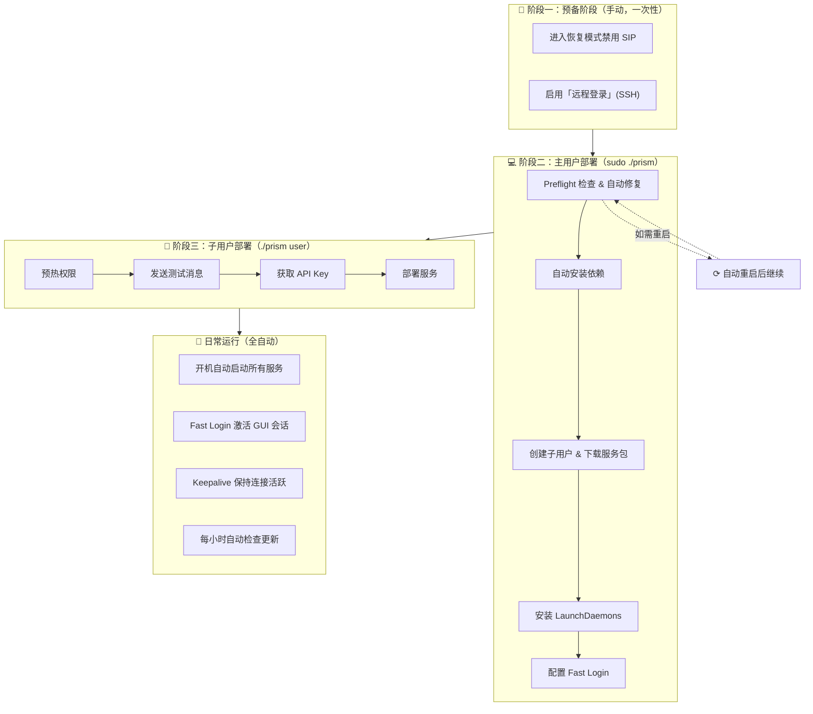

# Prism

[English](../README.md)

在一台 Mac 上部署多个 iMessage 中继服务的自动化工具。

**核心功能**：Prism 会创建多个 macOS 用户账户，为每个用户安装独立的 iMessage Server + frpc 隧道，并确保所有服务在重启后自动运行。

---

## 目录

- [部署流程概述](#部署流程概述)
- [阶段一：预备阶段（手动操作）](#阶段一预备阶段手动操作)
- [阶段二：主用户部署阶段（Host 模式）](#阶段二主用户部署阶段host-模式)
- [阶段三：子用户部署阶段（User 模式）](#阶段三子用户部署阶段user-模式)
- [阶段四：维护操作](#阶段四维护操作)
- [配置参考](#配置参考)
- [文件结构](#文件结构)
- [故障排查](#故障排查)

---

## 部署流程概述



---

## 阶段一：预备阶段（手动操作）

此阶段需要**手动完成**，是 Prism 运行的前提条件。

### 1.1 禁用 SIP（System Integrity Protection）

SIP 必须禁用，否则 Prism 无法注入 iMessage 进程。

**操作步骤：**

1. 关机
2. 按住电源键不放，直到看到「正在载入启动选项」
3. 选择「选项」进入恢复模式
4. 打开菜单栏「实用工具」→「终端」
5. 执行命令：
   ```bash
   csrutil disable
   ```
6. 重启 Mac

**验证：**
```bash
csrutil status


# 应显示：System Integrity Protection status: disabled.
```

> 💡 **为什么需要禁用 SIP？**
> iMessage 服务需要注入 `imagent` 进程来拦截和发送消息。SIP 会阻止这种注入行为。

### 1.2 启用远程管理和远程登录

**操作步骤：**

1. 打开「系统设置」→「通用」→「共享」


2. 开启「远程管理」，点击 ⓘ 按钮，选择「所有用户」


3. 开启「远程登录」，点击 ⓘ 按钮，选择「所有用户」


> 💡 **为什么需要这两项？**
> - **远程登录 (SSH)**：Fast Login 通过 SSH 建立本地 VNC 隧道
> - **远程管理 (VNC)**：允许通过 VNC 连接激活子用户的 GUI 会话
>
> iMessage 需要 GUI 会话才能正常接收消息，Fast Login 会自动完成这一切。

---

## 阶段二：主用户部署阶段（Host 模式）

以**管理员身份**运行 Prism，完成主机初始化和子用户创建。

### 2.1 创建配置文件

```bash
cp config/prism.json.example config/prism.json
```

编辑 `config/prism.json`：

```json
{
  "globals": {
    "machine_id": "mymac",
    "default_password": "Photon2025",
    "frpc": {
      "server_addr": "your-frps-server.com",
      "server_port": 7000
    },
    "domain_suffix": "imsg.example.com",
    "service": {
      "archive_url": "gh://your-org/your-repo/bundle-macos-arm64.tar.gz",
      "start_port": 10001
    },
    "nexus": {
      "base_url": "https://your-backend.com"
    }
  }
}
```

### 2.2 设置环境变量

创建 `.env` 文件（或直接导出）：

```bash
FRPC_TOKEN=your_frpc_auth_token
GITHUB_TOKEN=your_github_token  # 用于下载私有仓库
```

### 2.3 获取 Prism 二进制

**方式一：下载预编译版本（推荐）**

从 [GitHub Releases](https://github.com/photon-hq/Prism/releases) 下载最新的 `prism-darwin-arm64.tar.gz` 并解压。

**方式二：本地编译**

```bash
go build -o prism ./cmd/prism
```

### 2.4 运行 Host 初始化

```bash
sudo ./prism
```

在 TUI 菜单中选择 **「Setup」**。


**Prism 会自动执行以下操作：**

#### Step 1: Preflight 检查与自动修复

| 检查项 | 操作 |
|--------|------|
| SIP 状态 | 仅验证，需手动禁用 |
| boot-args | **自动设置** AMFI 相关参数 |
| DisableLibraryValidation | **自动设置** 为 true |

> 💡 **关于 AMFI 参数：**
> Prism 会自动执行 `nvram boot-args="amfi_get_out_of_my_way=1 amfi_allow_any_signature=1 -arm64e_preview_abi ipc_control_port_options=0"`，无需手动操作。

> ⚠️ **关于自动重启：**
> 如果 boot-args 或 DisableLibraryValidation 被修改，系统会显示 10 秒倒计时后**自动重启**。可按 `Ctrl+C` 取消改为手动重启。重启后请重新运行 `sudo ./prism` 继续。

#### Step 2: 安装依赖

Prism 会自动检测并安装缺失的依赖：

- **Homebrew** → 自动运行官方安装脚本
- **Node.js 18** → `brew install node@18`
- **frpc** → `brew install frpc`

> 💡 **运行身份切换：**
> 由于 Homebrew 禁止以 root 身份运行，Prism 会自动使用 `SUDO_USER` 降权执行 brew 命令。

#### Step 3: 创建子用户

输入要创建的用户数量（例如 3）后，Prism 会：

1. 创建 macOS 用户：`mymac-1`, `mymac-2`, `mymac-3`
2. 生成随机密码（或使用配置的默认密码）
3. 将密码保存到 `output/secrets/users.csv`

#### Step 4: 下载服务包

为每个用户下载并解压 iMessage 服务包到 `~/services/imsg/`：

- 写入 `config.json`（含端口、域名等）
- 写入 `frpc.toml`（含隧道配置）
- 复制 `prism` 二进制到用户目录

> 💡 **支持私有仓库：**
> 配置 `GITHUB_TOKEN` 环境变量后，可从私有 GitHub 仓库下载服务包。URL 格式：`gh://org/repo/file.tar.gz`

#### Step 5: 安装 LaunchDaemons

在 `/Library/LaunchDaemons/` 创建系统级守护进程：

| LaunchDaemon | 功能 |
|--------------|------|
| `com.prism.host-autoboot` | Host 守护进程 |
| `com.imsg.server.<username>` | iMessage Server |
| `com.imsg.frpc.<username>` | frpc 隧道 |

> 💡 **无需登录即可启动：**
> LaunchDaemons 使用 `UserName` 键以指定用户身份运行，配合 `RunAtLoad` 和 `KeepAlive` 确保开机后自动启动，无需任何用户登录。

#### Step 6: 配置 Fast Login

Prism 会在管理员用户目录安装 Fast Login 服务：

- 脚本：`~/prism-fast-login.sh`
- LaunchAgent：`~/Library/LaunchAgents/com.prism.fast-login.plist`

> 💡 **Fast Login 工作原理：**
> 管理员登录后，脚本自动通过 SSH 建立本地 VNC 隧道（5901-590x 端口），依次连接每个子用户完成 VNC 认证，激活其 GUI 会话。激活后 VNC 窗口自动关闭，子用户会话保持活跃。这样 iMessage 才能正常接收消息。

**完成后：**
- 用户密码保存在 `output/secrets/users.csv`
- 状态信息保存在 `output/state.json`

---

## 阶段三：子用户部署阶段（User 模式）

对每个创建的子用户，需要**登录该用户账户**完成首次配置。

### 3.1 切换到子用户

1. 登出当前管理员账户
2. 登录子用户（例如 `mymac-1`）
3. 密码见 `output/secrets/users.csv`

### 3.2 运行 User 部署

```bash
cd ~/services/imsg
./prism user
```


按顺序执行以下操作：

#### Step 1: Prewarm permissions（预热权限）

选择菜单项后，会触发 macOS 权限弹窗。请依次点击**「允许」**：

- Messages 自动化访问
- System Events 自动化访问
- Full Disk Access（如提示）

> 💡 **为什么需要这些权限？**
> - Messages 访问：读取 `chat.db` 获取手机号/邮箱
> - System Events：发送按键事件实现自动化
> - Full Disk Access：访问 `~/Library/Messages/` 目录

#### Step 2: 发送一条测试消息

打开 Messages 应用，向任意联系人**发送一条 iMessage**。

> ⚠️ **这一步非常重要！**
> Prism 通过查询 `chat.db` 中**已发送消息**的 `account` 字段来自动检测你的手机号或邮箱。如果没有发送过消息，数据库中没有记录，自动检测会失败。

#### Step 3: Get API key（获取 API 密钥）

向后端 Nexus 请求一次性 API Key。**请务必复制保存！**

> 💡 **API Key 的用途：**
> 这个 Key 用于 iMessage Server 与后端通信，是服务正常运行的必要凭证。

#### Step 4: Deploy / start services（部署服务）

此步骤会：
1. 验证配置文件 (`config.json`, `frpc.toml`)
2. 自动检测手机号/邮箱（从 `chat.db` 查询）
3. 启动 iMessage Server 和 frpc（通过 `launchctl kickstart`）
4. 等待健康检查通过 (`http://localhost:<port>/health`)
5. 安装 Keepalive 心跳服务

> 💡 **手机号检测原理：**
> Prism 查询 `chat.db` 中已发送消息的 `account` 字段，优先返回手机号（`P:+1234567890`），其次邮箱（`E:user@icloud.com`）。

> 💡 **Keepalive 服务：**
> 部署成功后会自动安装心跳服务（`~/Library/LaunchAgents/com.imessage.keepalive.plist`），每 10 分钟读取一次 `chat.db` 并触发 `imagent` XPC，防止 iMessage 因长时间无活动断开连接。日志位于 `~/Library/Logs/imessage-keepalive.log`。

> 💡 **如果自动检测仍然失败：**
> 可使用菜单中的「Rename friendly name」手动设置手机号或邮箱。

#### 其他 User 模式操作

| 菜单项 | 功能 |
|--------|------|
| **Stop all services** | 停止 iMessage Server 和 frpc |
| **Start all services** | 启动服务（停止后使用） |
| **Restart server** | 仅重启 iMessage Server |
| **Restart frpc** | 仅重启 frpc 隧道 |
| **Rename friendly name** | 手动设置手机号/邮箱并重启 frpc |

> 💡 **服务不会随 TUI 退出而停止：**
> 选择 "Quit" 退出 Prism 不会影响正在运行的服务。服务由 LaunchDaemons 管理，会持续运行。

### 3.3 对其他子用户重复操作

对 `mymac-2`, `mymac-3` 等其他子用户，重复步骤 3.1-3.2。

> 💡 **后续重启无需手动登录：**
> 首次配置完成后，机器重启会自动：
> 1. LaunchDaemons 启动所有用户的 iMessage Server 和 frpc
> 2. 管理员登录后 Fast Login 自动激活子用户 GUI 会话
> 3. Keepalive 保持 iMessage 连接活跃

---

## 阶段四：维护操作

日常运行中可在 Host 模式下进行以下操作。

### 4.1 进入 Host 管理界面

```bash
sudo ./prism
```

### 4.2 可用操作

| 菜单项 | 功能 |
|--------|------|
| **Add users** | 添加更多子用户 |
| **View users** | 查看当前用户列表和密码路径 |
| **Update user code** | 更新所有用户的 iMessage 服务代码 |
| **Check service status** | 检查所有用户的服务运行状态 |
| **Remove user** | 选择并删除指定用户 |

> 💡 **Update user code 做了什么？**
> 1. 从远程下载最新服务包
> 2. 同步到所有用户的 `~/services/imsg/` 目录
> 3. 重启正在运行的服务
> 4. 更新 Keepalive 脚本到最新版本

### 4.3 自动更新机制

Host 守护进程 (`com.prism.host-autoboot`) 会**每小时自动检查**服务包更新。

**工作原理：**
1. 调用 GitHub API 获取 `archive_url` 指向仓库的最新 release
2. 对比本地版本文件 (`output/cache/current_version.txt`) 与最新 tag
3. 如有新版本：下载 → 解压 → 同步到所有用户目录 → 重启运行中的服务
4. 记录新版本号，下次检查时跳过

> 💡 **自动更新条件：**
> - `archive_url` 必须使用 `gh://` 格式
> - 不能使用固定版本 `@tag` 语法
> - 需要配置 `GITHUB_TOKEN` 访问私有仓库

> 💡 **查看更新日志：**
> 守护进程日志输出到系统日志，可通过以下命令查看：
> ```bash
> log show --predicate 'subsystem == "com.apple.launchd"' --info --last 1h | grep prism
> ```

### 4.4 查看日志

```bash
# iMessage Server 日志
tail -100 ~/Library/Logs/imsg-server.log

# frpc 隧道日志
tail -100 ~/Library/Logs/frpc.log

# Keepalive 心跳日志
tail -100 ~/Library/Logs/imessage-keepalive.log

# Fast Login 日志（管理员账户下）
tail -100 ~/Library/Logs/prism-fast-login.log
```

---

## 配置参考

### prism.json 字段

| 字段 | 说明 | 示例 |
|------|------|------|
| `machine_id` | 用户名前缀 | `"mymac"` → 创建 `mymac-1`, `mymac-2` |
| `default_password` | 新用户密码（留空则随机生成） | `"Photon2025"` |
| `frpc.server_addr` | frps 服务端地址 | `"frps.example.com"` |
| `frpc.server_port` | frps 服务端端口 | `7000` |
| `domain_suffix` | 子域名后缀 | `"imsg.example.com"` |
| `service.archive_url` | 服务包下载地址 | `"gh://org/repo/file.tar.gz"` |
| `service.start_port` | 第一个用户的端口，后续递增 | `10001` |
| `nexus.base_url` | 后端 API 地址 | `"https://api.example.com"` |

> 💡 **archive_url 格式：**
> - 基础格式：`gh://owner/repo/filename.tar.gz`（自动拉取最新 release）
> - 固定版本：`gh://owner/repo/filename.tar.gz@v1.0.0`（固定到指定 tag，禁用自动更新）

### 环境变量

| 变量 | 说明 |
|------|------|
| `FRPC_TOKEN` | frpc 认证令牌，写入每个用户的 `frpc.toml` |
| `GITHUB_TOKEN` | 用于下载私有 GitHub 仓库 |
| `PRISM_CONFIG` | 覆盖配置文件路径（默认 `config/prism.json`） |
| `PRISM_STATE` | 覆盖状态文件路径（默认 `output/state.json`） |

---

## 文件结构

部署时只需以下文件：

```
Prism/
├── prism                       # 编译好的二进制文件
├── .env                        # 环境变量（FRPC_TOKEN, GITHUB_TOKEN）
├── .env.example                # 环境变量示例
└── config/
    ├── prism.json              # 配置文件（需根据实际情况修改）
    └── prism.json.example      # 配置文件示例
```

运行后会自动生成：

```
Prism/
├── output/
│   ├── state.json              # 状态文件（记录已创建的用户等）
│   └── secrets/
│       └── users.csv           # 用户密码记录

/Users/<username>/services/imsg/    # 每个子用户的服务目录
├── config.json                 # 用户配置
├── frpc.toml                   # frpc 隧道配置
├── prism                       # prism 二进制副本
└── [iMessage 服务包文件...]

/Library/LaunchDaemons/         # 系统级守护进程
├── com.prism.host-autoboot.plist
├── com.imsg.server.<username>.plist
└── com.imsg.frpc.<username>.plist

/Users/<admin>/Library/LaunchAgents/    # 管理员用户的 LaunchAgent
└── com.prism.fast-login.plist

/Users/<username>/Library/LaunchAgents/ # 子用户的 LaunchAgent
└── com.imessage.keepalive.plist
```

---

## 故障排查

### SIP 仍然启用

进入恢复模式运行 `csrutil disable`，然后重启。

### Preflight 失败：无法设置 boot-args

确保以 `sudo ./prism` 方式运行（不是 `sudo -i` 或 root shell）。

### 服务未启动

```bash
# 检查 LaunchDaemon 状态
sudo launchctl list | grep imsg

# 查看日志
tail -100 ~/Library/Logs/imsg-server.log
```

### 手机号未检测

在 Messages 发送至少一条 iMessage，或使用「Rename friendly name」手动设置。

### Fast Login 未激活子用户会话

1. 确保已启用「远程登录」(SSH)
2. 确保管理员用户已登录（Fast Login 需要管理员 GUI 会话触发）
3. 查看日志：`tail -100 ~/Library/Logs/prism-fast-login.log`

### iMessage 收不到消息

1. 确保子用户 GUI 会话已激活（Fast Login 或手动登录）
2. 检查 Keepalive 服务：`launchctl list | grep keepalive`
3. 查看心跳日志：`tail -100 ~/Library/Logs/imessage-keepalive.log`

---

## 构建

```bash
# 本地构建
go build -o prism ./cmd/prism

# 精简体积
go build -o prism -ldflags "-s -w" ./cmd/prism
```

推送 `v*.*.*` 格式的 tag 会自动触发 GitHub Actions 发布。

---

## License

MIT
